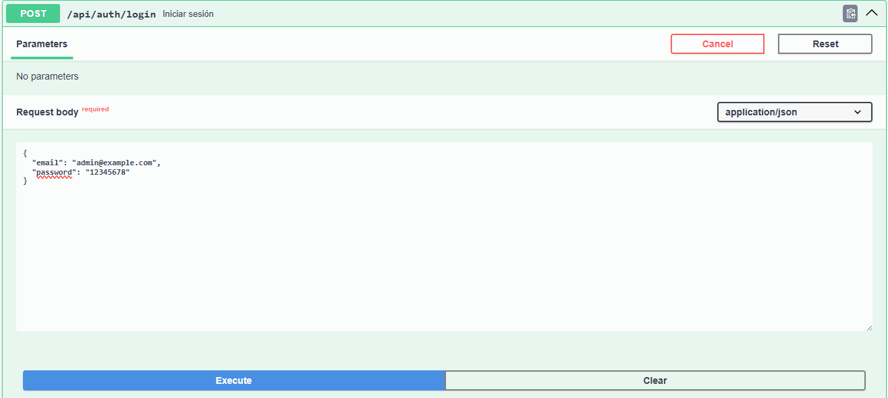

## Instalacion

pasos para instalar laravel y correr el api

clonar el proyecto : https://github.com/alexisyordano/ApiClimate.git

accedemos al proyecto y corremos el comando: composer install

copiamos el archio .env.example para crear un archiovo .env

este archivo debe llevar estas propiedades

WEATHER_API_KEY=c4d6b0021f4d47b3aea141856251405

DB_CONNECTION=mysql
DB_HOST=127.0.0.1
DB_PORT=3306
DB_DATABASE=apiclimate
DB_USERNAME=root
DB_PASSWORD=

luego corremos: php artisan key:generate

Luego corremos las migraciones: php artisan migrate

luego ejecutamos el Seeder: php artisan db:seed --class=RolesAndPermissionsSeeder
esto creara un usuario con rol Admin y permisos

usuario es: admin@example.com
clave es: 12345678

luego levantamos el api

php artisan serve

accedemos a Swagger http://127.0.0.1:8000/api/documentation

## Uso

